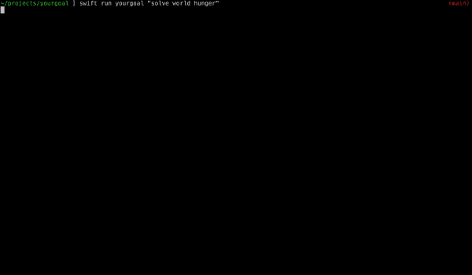

# yourgoal

Swift implementation of [BabyAGI](https://github.com/yoheinakajima/babyagi)

This is a Swift port of BabyAGI, an example of an AI-powered task management system that uses OpenAI and Pinecone APIs to create, prioritize, and execute tasks. The main idea behind this system is that it creates tasks based on the result of previous tasks and a predefined objective.

### Notes

* Don't be stupid
* Look in the .env.example for how to input keys

### Backstory

I had written some previous code prior to BabyAGI that just iterated on writing and executing code in a loop. Was kinda boring though, and I realized I had most of the pieces in place to port BabyAGI to Swift, so I decided to give it a shot. Also gave me a chance to learn about [Pinecone.io](https://www.pinecone.io). All the credit due is to [yoheinakajima](https://github.com/yoheinakajima), I just ported and iterated a bit. Might keep going with it though, who knows.

### Developer Commands

`export $(grep -v '^#' .env | xargs)` Parse environment variables

`swift build` Builds app to the `.build` folder

`swift build -c release` Build a release version

`./.build/debug/yourgoal` Runs app after building

`swift run yourgoal` Runs app directly
